  

<!--tagline-->

  

  

<h2 align="left">序 &nbsp;·&nbsp; About Me</h2>

<h4 align="left">
Hi, I'm <b>Nicolás Mosquera Sánchez</b>. A technician trained in the full <b>data lifecycle</b> for Artificial Intelligence. My craft: data extraction, cleaning (ETL), and systematization for Machine Learning models wielding applied statistics and Python to bring order and efficiency to business processes.
  
&nbsp;I currently collaborate with <a href="https://alvaroamosquerae.com">alvaroamosquerae.com</a>, an end-to-end digital solution for transforming service-based businesses.
  
&nbsp;Driven by everything that unites <b>data + automation</b>: record-keeping systems, virtual agents, and workflows that run without a hand on the blade.
  
 📫 &nbsp;<a href="mailto:nicolasanchezms@gmail.com">nicolasanchezms@gmail.com</a>
</h4>

<h2 align="left">巻物 &nbsp;·&nbsp; Works & Experience</h2>

<h4 align="left">
📊 &nbsp;<b>Full automation for a barbershop</b> bound by legacy methods: replacing an analog, ambiguous workflow with a structured data architecture that guards information integrity and operational efficiency.
  
🤖 &nbsp;<b>Virtual agents & automation</b>: automated workflows with n8n and scripts that cut repetitive tasks and sharpen operations.
  
🎨 &nbsp;<b>Web development</b>: websites crafted with modern design and prototyping tools.
</h4>

<!-- ══════════════════ STACK / ARSENAL ══════════════════ -->
<h2 align="left">武器 &nbsp;·&nbsp; Arsenal</h2>

  
  
  
  
  
  
  
  
  
  
  
  
  
  
  
  
  

<!-- ══════════════════ SPOTIFY / NOW PLAYING ══════════════════ -->
<h2 align="left">音 &nbsp;·&nbsp; Now Playing</h2>

  

 

<!-- ══════════════════ FOOTER ══════════════════ -->

  <i>「乱中有机」 — In the midst of chaos, there is also opportunity.</i>

