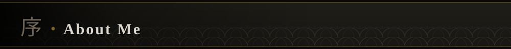
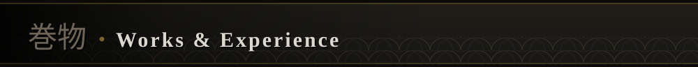
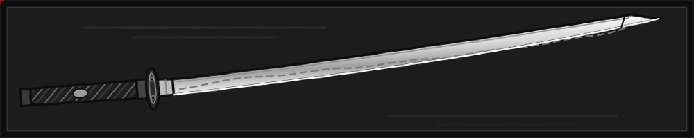
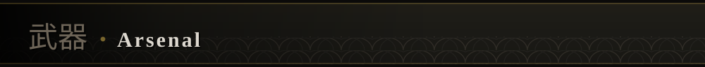
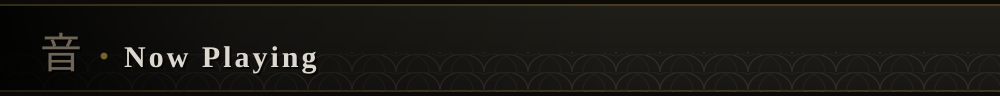

  

  

Hi, I'm <b>Svnchezzz</b>. A technician trained in the full <b>data lifecycle</b> for Artificial Intelligence. My craft: data extraction, cleaning (ETL), and systematization for Machine Learning models wielding applied statistics and Python to bring order and efficiency to business processes.
  
I currently collaborate with <a href="https://alvaroamosquerae.com">alvaroamosquerae.com</a>, an end-to-end digital solution for transforming service-based businesses.
  
Driven by everything that unites <b>data + automation</b>: record-keeping systems, virtual agents, and workflows that run without a hand on the blade.
  
📫 &nbsp;<a href="mailto:nicolasanchezms@gmail.com">nicolasanchezms@gmail.com</a>

💰 &nbsp;<b>Personal finance app</b>: a tool that brings order to money management, recording income and expenses, categorizing every movement, and showing clear balances so tracking your finances stops being a chore.

  
   
  

 

https://github.com/user-attachments/assets/PEGA-AQUI-EL-ID-DEL-VIDEO

 

📊 &nbsp;<b>Full automation for a barbershop</b> bound by legacy methods: replacing an analog, ambiguous workflow with a structured data architecture that guards information integrity and operational efficiency.
  
🤖 &nbsp;<b>Virtual agents & automation</b>: automated workflows with n8n and scripts that cut repetitive tasks and sharpen operations.
  
🎨 &nbsp;<b>Web development</b>: websites crafted with modern design and prototyping tools.

  

 

  
  
  
  
  
  
  
  
  
   
  
  
  
  
  
  
  

 

 

  

 

  <i>「乱中有機」 — In the midst of chaos, there is also opportunity.</i>

